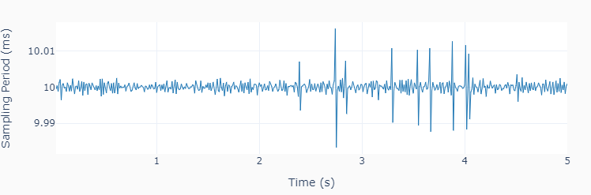

Digital I/O
===========

This example :ref:`code <codedigital>` shows how to use digital inputs and outputs in a data
acquisition loop. If you're using a **LabJack U3**, random digital outputs (0 or 1)
are generated at a constant time interval of 0.2 s on ports **FIO4** and **FIO5**.
Ports **FIO6** and **FIO7** are used to sample the signals at a constant time interval
of 10 ms. The variability on the sampling period is less than 0.02 ms.

.. image:: ../../images/lj_io_digital_fig_1.png

.. _codedigital:

.. code-block:: python

    """ lj_io_digital.py 

    Uses digital input and output channels.

    This example shows how to use digital inputs and outputs in a data acquisition
    loop. Accurate time execution of events can be achieved by the use of a timer
    logic in the loop. The voltage measurements are executed at a fixed sampling
    period.

    Setup:
        On a U3, connect FIO4 to FIO6, and FIO5 to FIO7
        On a U6, connect FIO0 to FIO2, and FIO1 to FIO3
        On a T7, connect FIO0 to FIO2, and FIO1 to FIO3

    The LabJack unified methods in this example are:
        set_digital ...... Writes digital value to specified port(s)
        get_digital ...... Reads digital value from specified port(s)
        close ............ Closes the LabJack device 

    """
    import time
    import numpy as np
    from labjack_unified.utils import plot_line
    from labjack_unified.devices import LabJackU3, LabJackU6, LabJackT7

    # To use a LabJack U6 or a T7, change the device name
    # from LabJackU3 below to either LabJackU6 or LabJackT7
    lj = LabJackU3()

    # Selecting port names based on the LabJack class
    if lj.__class__ == LabJackU3:
        portout = ['FIO4', 'FIO5']
        portin = ['FIO6', 'FIO7']
    else:
        portout = ['FIO0', 'FIO1']
        portin = ['FIO2', 'FIO3']

    # Assigning parameters
    tstep = 0.2 # Interval between step changes (s)
    tsample = 0.01 # Data sampling period (s)
    t = [] # Output time array
    s1 = [] # Output sampled state 1 array
    s2 = [] # Output sampled state 2 array

    # Initializing timers and starting main clock
    tprev = 0
    tcurr = 0
    tstart = time.perf_counter()
    # Executing acquisition loop
    print('Running code for 5 seconds ...')
    while tcurr <= 5:
        # Updating digital output every `tstep` seconds
        # with random values between 0 and 1
        if (np.floor(tcurr/tstep) - np.floor(tprev/tstep)) == 1:
            lj.set_digital(portout[0], np.round(np.random.rand()))
            lj.set_digital(portout[1], np.round(np.random.rand()))
        # Updating previous time and getting current time (s)
        tprev = tcurr
        tcurr = time.perf_counter() - tstart
        # Acquiring digital data every `tsample` seconds
        # and appending values to output arrays
        if (np.floor(tcurr/tsample) - np.floor(tprev/tsample)) == 1:
            t.append(tcurr)
            s1.append(lj.get_digital(portin[0]))
            s2.append(lj.get_digital(portin[1]))
    print('Done.')
    # Closing the device
    lj.close()
    del lj

    # Plotting results 
    plot_line([t]*2, [s1, s2], yname=portin, axes='multi')
    plot_line([t[1::]], [1000*np.diff(t)], yname=['Sampling Period (ms)'])

