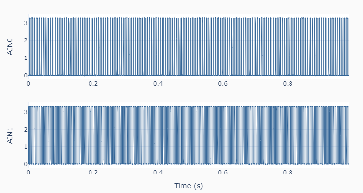

Streaming
=========

In this example :ref:`code <codestreaming>`, data is acquired at 50,000 Samples/s, for two
consecutive 0.5 s blocks. On a **LabJack U3**, two 183 Hz PWM signals are generated
on ports **FIO4** and **FIO5**, and streamed into **AIN0** and **AIN1**, repectively.

.. _codestreaming:

.. code-block:: python

    """ lj_streaming.py 

    Collects streaming data.

    Data is acquired at a user-defined `samplerate` up to 50000 Samples/s on a U3
    or a U6, and 100000 Samples/s on a T7. The effective sampling rate per channel 
    is `samplerate` divided by the number of channels. Data blocks are collected 
    at a user-defined `readrate` in seconds. Typical values of 0.5 seconds are used
    for high sample rates.

    Setup:
        In this example code, 2 PWM signals are generated on the following ports:
        FIO4 and FIO5 on a U3
        FIO0 and FIO1 on a U6
        FIO0 and FIO4 on a T7
        which in turn should be connected respectively to ports AIN0 and AIN1.

    The LabJack unified methods in this example are:
        set_PWM .......... Sets LabJack configuration for PWM output
        set_dutycycle .... Sets duty cycle of PWM output (-100 to 100)
        set_stream ....... Sets LabJack configuration for data streaming
        get_stream ....... Gets streaming data
        stop_stream ...... Stops data streaming
        close ............ Closes the LabJack device 

    """
    import time
    import numpy as np
    from labjack_unified.utils import plot_line
    from labjack_unified.devices import LabJackU3, LabJackU6, LabJackT7

    # To use a LabJack U6 or a T7, change the device name
    # from LabJackU3 below to either LabJackU6 or LabJackT7
    lj = LabJackU3()

    # Assigning streaming parameters
    samplerate = 50000 # Samples/s
    readrate = 0.5 # Block size (s)
    nblocks = 2 # Number of acquired blocks
    portlist = ['AIN0', 'AIN1']
    # Creating array with dummy values to enable concatenation
    data = np.zeros((1, len(portlist)))

    # Setting a PWM output
    lj.set_pwm(pwmnum=2, frequency=183)
    lj.set_dutycycle(value1=25, value2=50)
    # Configuring and starting streaming
    lj.set_stream(portlist, scanrate=samplerate, readrate=readrate)
    # Waiting for first block to become available
    time.sleep(readrate)
    # Executing acquisition loop
    for i in range(nblocks):
        # Starting computational overhead time watch
        t0 = time.time()
        # Getting one block of data
        dt, datablock, numscans, commbacklog, U3backlog = lj.get_stream()
        # Concatenating new data
        data = np.vstack((data, datablock))
        # Showing statistics
        print('Block :', i+1)
        print('Scans :', numscans)
        print('Comm Backlog : {:0.1f}'.format(commbacklog))
        print('U3 Backlog   : {:0.1f}'.format(U3backlog))
        # Pausing taking into account computation overhead
        thead = time.time()-t0
        time.sleep(readrate-thead)
    # Stopping streaming
    lj.stop_stream()
    # Closing LabJack
    lj.close()
    del lj

    # Removing first row of dummy data
    data = data[1::, :]
    # Creating time array
    t = dt * np.linspace(0, data.shape[0]-1, data.shape[0])
    # Setting x and y arrays for plotting
    naxes = len(portlist)
    x = [t] * naxes
    y = [data[:, i] for i in range(naxes)]
    # Plotting results
    plot_line(x, y, yname=portlist, axes='multi')
