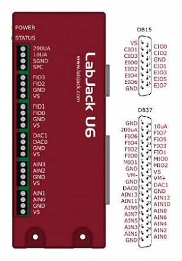

LabJackU6
=========

.. autoclass:: devices.LabJackU6
    :no-members:

General
-------

    .. automethod:: devices.LabJackU6.close

    .. automethod:: devices.LabJackU6.display_info

    .. automethod:: devices.LabJackU6.get_labjacktemp

I/O
---

    .. automethod:: devices.LabJackU6.set_digital

    .. automethod:: devices.LabJackU6.get_digital

    .. automethod:: devices.LabJackU6.get_bitdir

    .. automethod:: devices.LabJackU6.set_analog

    .. automethod:: devices.LabJackU6.get_analog

    .. automethod:: devices.LabJackU6.set_range

Streaming
---------

    .. automethod:: devices.LabJackU6.set_stream

    .. automethod:: devices.LabJackU6.stop_stream

    .. automethod:: devices.LabJackU6.get_stream

PWM
---

    .. automethod:: devices.LabJackU6.set_pwm

    .. automethod:: devices.LabJackU6.set_pwm_quad

    .. automethod:: devices.LabJackU6.set_dutycycle

Quadrature
----------

    .. automethod:: devices.LabJackU6.set_quadrature

    .. automethod:: devices.LabJackU6.get_counter

    .. automethod:: devices.LabJackU6.reset_counter
