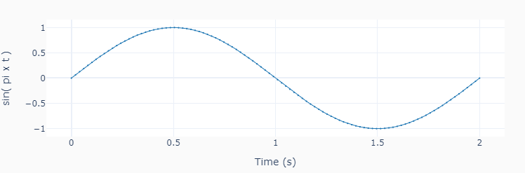
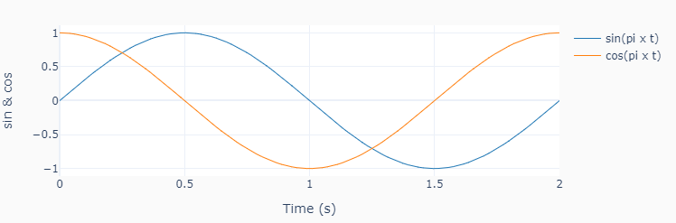
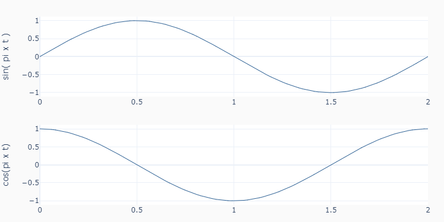

Utils
=====

Contains a useful plotting function that is used in the coding examples.
The function was built using `Plotly <https://plotly.com/python/>`__ instead
of `Matplotlib <https://matplotlib.org/>`__ due to its interactive graphs.
It works well in an interactive session in `VSCode <https://code.visualstudio.com/>`__.
In terminal mode, the results are displayed in a web browser.

.. autofunction:: utils.plot_line

>>> import numpy as np
>>> from pyev3.utils import plot_line
>>> t = np.linspace(0,2,100)
>>> y0 = np.sin(1*np.pi*t)
>>> y1 = np.cos(1*np.pi*t)

>>> plot_line([t], [y0], yname='sin( pi x t )', marker=True)

>>> plot_line([t]*2, [y0, y1],
              yname=['sin & cos'],
              legend=['sin(pi x t)', 'cos(pi x t)'])

>>> plot_line([t]*2, [y0, y1],
              yname=['sin( pi x t )', 'cos(pi x t)'],
              axes='multi')

