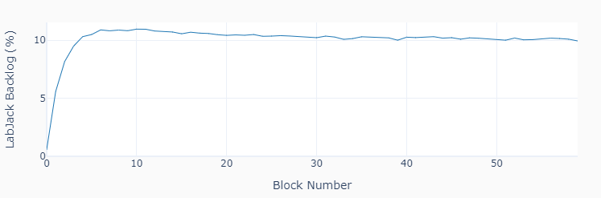

# Examples
These are some examples that can be executed with any **LabJack** (**U3**, **U6**, or **T7**). The table below shows the hardware that is required to run them. Four of the examples only need a pair of wires. The _ljt7_ examples require a **T7** device.

Example | Hardware Requirements
------- | ----------------------
lj_io_analog.py | Two wires
lj_io_digital.py | Two wires
lj_streaming.py | Two wires
ljt7_streaming_internal.py | Two wires
lj_encoder_absolute.py | Quadrature encoder wit A-B-Z phases
lj_encoder_incremental.py | Quadrature encoder wit A-B phases
lj_motor.py | 12V power supply, 12V DC motor, H-Bridge
lj_motor_encoder.py | 12V power supply, 12V DC motor, H-Bridge
ljt7_streaming_external.py | 12V power supply, 12V DC motor, H-Bridge, A-B-Z encoder

The idea of the examples is to go beyond just using the LabJack device, by showing some execution loop and sampling techiques. For best graphic display of the results, consider running them in an interactive Jupyter notebook session (instead of a plain old terminal window).

## lj_io_analog.py
This example shows how to use analog inputs and outputs in a data acquisition
loop. Random voltage outputs (between 0 and 5 V) are generated at a constant time interval of 0.5 s on ports **DAC0** and **DAC1**. Ports **AIN0** and **AIN1** are used to sample the voltages as fast as possible. The data acquisition latency (in average under 2 ms) is due mostly to the **LabJack** I/O times. Accurate time execution of output events can be achieved by the use of a timer logic in the loop.

## lj_io_digital.py
This example shows how to use digital inputs and outputs in a data acquisition loop. Random digital outputs (0 or 1) are generated at a constant time interval of 0.2 s on ports **FIO4** and **FIO5**. Ports **FIO6** and **FIO7** are used to sample the signals at a constant time interval of 10 ms. The variability on the sampling period is less than 0.02 ms.

## lj_streaming.py
Data is acquired at 50,000 Samples/s, for two consecutive 0.5 s blocks. Two 183 Hz PWM signals are generated on ports **FIO4** and **FIO5**, and streamed into **AIN0** and **AIN1**, repectively.

## ljt7_streaming_internal.py
For extended or indefinite streaming time, using a PI closed-loop control on the **LabJack** data backlog will prevent an eventual overflow (or starvation) of the streaming data buffer. This seems to be more critical on the **T7** device. This example also streams two 183 Hz PWM signals into ports **AIN0** and **AIN1**, but for a total of 60 blocks of 0.5 s each. The first figure shows the last 2 blocks of data, while the second figure shows the backlog as a function of time for the 30 s duration of the streaming. The target backlog value is 10%.

